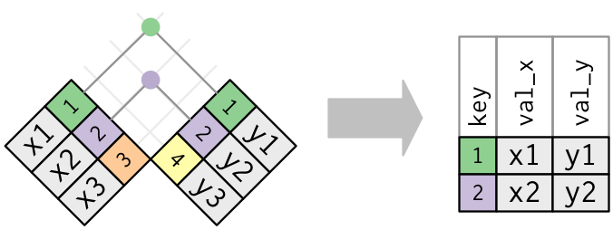
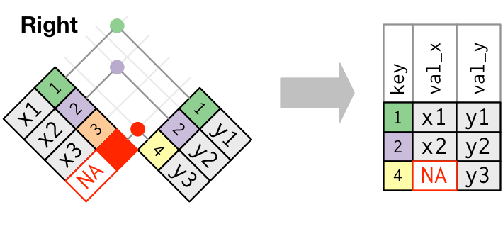
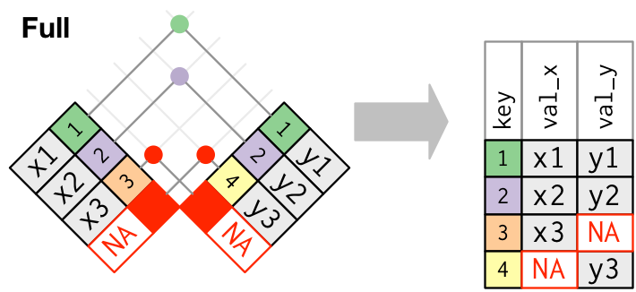

## Attention!

::: {.callout-caution appearance="minimal"}
Here, I assume:

1.  that you already know how to import data into R.
2.  that you already know how to use `{tidyverse}` workflow using pipes (`%>%`) from `{magrittr}` or native pipes (`|>`). I will use native pipes.

The goal of today's class is to identify:

-   what do we need to merge different data sets?

-   what are possible/potential problems when we merge data sets?
:::

## Load Packages


::: {.cell}

```{.r .cell-code}
if (!require(tidyverse)) install.packages("tidyverse")
library(tidyverse)
```
:::


## Example Data in Use

We will use two different example data sets from `V-Dem` and `World Development Indicators`. The two example data sets are available for download here: [example1](https://github.com/pherephobia/3_NazarbayevDS/blob/90f4c802cd9ad18d1fb33c43332a434dc0d71656/examples/example1.csv) and [example2](https://github.com/pherephobia/3_NazarbayevDS/blob/90f4c802cd9ad18d1fb33c43332a434dc0d71656/examples/example2.csv). Because the example data is in csv format, you must use the appropriate function to import the example data sets into R. I put them in a folder called `examples`. We will also use other data sets that are built into R.


::: {.cell}

```{.r .cell-code}
example1 <- read_csv("examples/example1.csv")
example2 <- read_csv("examples/example2.csv")
```
:::


Let's look at the data set structures:


::: {.cell}

```{.r .cell-code}
glimpse(example1)
```

::: {.cell-output .cell-output-stdout}
```
Rows: 3,922
Columns: 9
$ country_name    <chr> "Mexico", "Mexico", "Mexico", "Mexico", "Mexico", "Mex…
$ country_text_id <chr> "MEX", "MEX", "MEX", "MEX", "MEX", "MEX", "MEX", "MEX"…
$ country_id      <dbl> 3, 3, 3, 3, 3, 3, 3, 3, 3, 3, 3, 3, 3, 3, 3, 3, 3, 3, …
$ year            <dbl> 2001, 2002, 2003, 2004, 2005, 2006, 2007, 2008, 2009, …
$ COWcode         <dbl> 70, 70, 70, 70, 70, 70, 70, 70, 70, 70, 70, 70, 70, 70…
$ v2x_polyarchy   <dbl> 0.684, 0.694, 0.702, 0.710, 0.710, 0.675, 0.644, 0.643…
$ e_polity2       <dbl> 8, 8, 8, 8, 8, 8, 8, 8, 8, 8, 8, 8, 8, 8, 8, 8, 8, 8, …
$ e_fh_cl         <dbl> 3, 2, 2, 2, 2, 3, 3, 3, 3, 3, 3, 3, 3, 3, 3, 3, 3, 3, …
$ e_fh_pr         <dbl> 2, 2, 2, 2, 2, 2, 2, 2, 2, 3, 3, 3, 3, 3, 3, 3, 3, 3, …
```
:::
:::


`example1` is drawn from the [V-Dem](https://v-dem.net/) data set. `glimpse()` function is tidyverse version of the base R function, `str()`, which shows the structure of a data frame. `example1` has 3,922 observations (rows) and 9 variables (columns). It has four id variables (`country_name`, `country_text_id`, `country_id`, `COWcode`), as well as one year variable (`year`). `v2x_polyarchy` is the "Electoral Democracy Index (EDI)," which measures procedural democracy based on the suggestions of @dahl1971a . `e_polity2` is an alternative measure of democracy from POLITY project, while `e_fh_cl` and `e_fh_pr` are drawn from the "Freedom House Index," which represents civil liberties and political rights.


::: {.cell}

```{.r .cell-code}
glimpse(example2)
```

::: {.cell-output .cell-output-stdout}
```
Rows: 4,220
Columns: 11
$ ccode                <dbl> 4, 4, 4, 4, 4, 4, 4, 4, 4, 4, 4, 4, 4, 4, 4, 4, 4…
$ cname                <chr> "Afghanistan", "Afghanistan", "Afghanistan", "Afg…
$ year                 <dbl> 2001, 2002, 2003, 2004, 2005, 2006, 2007, 2008, 2…
$ ccodealp             <chr> "AFG", "AFG", "AFG", "AFG", "AFG", "AFG", "AFG", …
$ cname_year           <chr> "Afghanistan 2001", "Afghanistan 2002", "Afghanis…
$ ccodealp_year        <chr> "AFG01", "AFG02", "AFG03", "AFG04", "AFG05", "AFG…
$ ccodecow             <dbl> 700, 700, 700, 700, 700, 700, 700, 700, 700, 700,…
$ ccodewb              <dbl> 4, 4, 4, 4, 4, 4, 4, 4, 4, 4, 4, 4, 4, 4, 4, 4, 4…
$ wdi_gdpcappppcon2017 <dbl> NA, 1189.785, 1235.810, 1200.278, 1286.794, 1315.…
$ wdi_pop1564          <dbl> 48.90547, 49.09875, 49.34294, 49.61243, 49.91287,…
$ wdi_trade            <dbl> NA, NA, NA, NA, NA, NA, NA, NA, NA, NA, NA, NA, N…
```
:::
:::


`example2` is from the [World Development Indicators](https://databank.worldbank.org/source/world-development-indicators), World Bank. When we look at the data, we see that there are 4,220 observations (rows) and 11 variables (columns). `example2` includes five country-id variables (`ccode`, `cname`, `ccodealp`, `ccodecow`, `ccodewb`) as well as year-related variables (`year`, `cname_year`, `ccodealp_year`). It also has two additional variables: GDP per capita, PPP (constant 2017 US dollars), which is gross domestic product converted to US dollars using purchasing power parity rates and the trade openness that is the sum of exports and imports of goods and services measured as a share of gross domestic product.

Because I filtered both example data sets from 2001, `example1` is between 2001 and 2022 and `example2` is between 2001 and 2020.

## Incomplete Data, what does it mean?

What does the term "incomplete data" mean? Because survey data is designed to answer specific questions, the information provided by the data is usually sufficient to answer our research questions. Also, as the units are different, it is difficult to merge survey data with other data sets unless we keep tracing and surveying the same respondents.

When we use non-survey observational data, we may run into an incomplete data problem, which means that a single data set is insufficient to answer our questions. To solve this problem, we must combine multiple incomplete data sets to make them complete.

The process of combining multiple data sets into a single data set is known as merging. Adding inflation factors to panel data to adjust income to today's rates is one example, as is adding county-level statistics to individual-level data. We'll look at two kinds of merges: adding columns from one data set to another and adding rows (also known as appending).

### Adding rows

The actual act of merging two data sets usually involves only one or two lines of code. Most of the work when merging happens before this, in preparing data frames for merging and in deciding which rows we want in the output.

Let’s create two data frames from `example1`: `example1_1` and `example1_2`.


::: {.cell}

```{.r .cell-code}
example1_1 <- example1 |> dplyr::select(1:6) |> 
  dplyr::filter(country_name %in% c("Mexico", "South Korea"))
example1_2 <- example1 |> dplyr::select(1:5, 7:9) |> 
  dplyr::filter(country_name %in% c("United States of America", "South Korea"))
```
:::


To merge two data frames, we need keys, identifiers that we can use to match one set of information to another. A common example of a key in the social sciences is a person ID, which can be used to link information across multiple data sets. However, our `example1` is not an individual level data. Thus, keys will be `country` and `year` identifiers: `country_name`, `country_text_id`, `country_id`, `COWcode`, `year`.


::: {.cell}

```{.r .cell-code}
head(example1_1)
```

::: {.cell-output-display}
`````{=html}
<div data-pagedtable="false">
  <script data-pagedtable-source type="application/json">
{"columns":[{"label":["country_name"],"name":[1],"type":["chr"],"align":["left"]},{"label":["country_text_id"],"name":[2],"type":["chr"],"align":["left"]},{"label":["country_id"],"name":[3],"type":["dbl"],"align":["right"]},{"label":["year"],"name":[4],"type":["dbl"],"align":["right"]},{"label":["COWcode"],"name":[5],"type":["dbl"],"align":["right"]},{"label":["v2x_polyarchy"],"name":[6],"type":["dbl"],"align":["right"]}],"data":[{"1":"Mexico","2":"MEX","3":"3","4":"2001","5":"70","6":"0.684"},{"1":"Mexico","2":"MEX","3":"3","4":"2002","5":"70","6":"0.694"},{"1":"Mexico","2":"MEX","3":"3","4":"2003","5":"70","6":"0.702"},{"1":"Mexico","2":"MEX","3":"3","4":"2004","5":"70","6":"0.710"},{"1":"Mexico","2":"MEX","3":"3","4":"2005","5":"70","6":"0.710"},{"1":"Mexico","2":"MEX","3":"3","4":"2006","5":"70","6":"0.675"}],"options":{"columns":{"min":{},"max":[10]},"rows":{"min":[10],"max":[10]},"pages":{}}}
  </script>
</div>
`````
:::
:::

::: {.cell}

```{.r .cell-code}
glimpse(example1_1)
```

::: {.cell-output .cell-output-stdout}
```
Rows: 44
Columns: 6
$ country_name    <chr> "Mexico", "Mexico", "Mexico", "Mexico", "Mexico", "Mex…
$ country_text_id <chr> "MEX", "MEX", "MEX", "MEX", "MEX", "MEX", "MEX", "MEX"…
$ country_id      <dbl> 3, 3, 3, 3, 3, 3, 3, 3, 3, 3, 3, 3, 3, 3, 3, 3, 3, 3, …
$ year            <dbl> 2001, 2002, 2003, 2004, 2005, 2006, 2007, 2008, 2009, …
$ COWcode         <dbl> 70, 70, 70, 70, 70, 70, 70, 70, 70, 70, 70, 70, 70, 70…
$ v2x_polyarchy   <dbl> 0.684, 0.694, 0.702, 0.710, 0.710, 0.675, 0.644, 0.643…
```
:::
:::

::: {.cell}

```{.r .cell-code}
head(example1_2)
```

::: {.cell-output-display}
`````{=html}
<div data-pagedtable="false">
  <script data-pagedtable-source type="application/json">
{"columns":[{"label":["country_name"],"name":[1],"type":["chr"],"align":["left"]},{"label":["country_text_id"],"name":[2],"type":["chr"],"align":["left"]},{"label":["country_id"],"name":[3],"type":["dbl"],"align":["right"]},{"label":["year"],"name":[4],"type":["dbl"],"align":["right"]},{"label":["COWcode"],"name":[5],"type":["dbl"],"align":["right"]},{"label":["e_polity2"],"name":[6],"type":["dbl"],"align":["right"]},{"label":["e_fh_cl"],"name":[7],"type":["dbl"],"align":["right"]},{"label":["e_fh_pr"],"name":[8],"type":["dbl"],"align":["right"]}],"data":[{"1":"United States of America","2":"USA","3":"20","4":"2001","5":"2","6":"10","7":"1","8":"1"},{"1":"United States of America","2":"USA","3":"20","4":"2002","5":"2","6":"10","7":"1","8":"1"},{"1":"United States of America","2":"USA","3":"20","4":"2003","5":"2","6":"10","7":"1","8":"1"},{"1":"United States of America","2":"USA","3":"20","4":"2004","5":"2","6":"10","7":"1","8":"1"},{"1":"United States of America","2":"USA","3":"20","4":"2005","5":"2","6":"10","7":"1","8":"1"},{"1":"United States of America","2":"USA","3":"20","4":"2006","5":"2","6":"10","7":"1","8":"1"}],"options":{"columns":{"min":{},"max":[10]},"rows":{"min":[10],"max":[10]},"pages":{}}}
  </script>
</div>
`````
:::
:::

::: {.cell}

```{.r .cell-code}
glimpse(example1_2)
```

::: {.cell-output .cell-output-stdout}
```
Rows: 44
Columns: 8
$ country_name    <chr> "United States of America", "United States of America"…
$ country_text_id <chr> "USA", "USA", "USA", "USA", "USA", "USA", "USA", "USA"…
$ country_id      <dbl> 20, 20, 20, 20, 20, 20, 20, 20, 20, 20, 20, 20, 20, 20…
$ year            <dbl> 2001, 2002, 2003, 2004, 2005, 2006, 2007, 2008, 2009, …
$ COWcode         <dbl> 2, 2, 2, 2, 2, 2, 2, 2, 2, 2, 2, 2, 2, 2, 2, 2, 2, 2, …
$ e_polity2       <dbl> 10, 10, 10, 10, 10, 10, 10, 10, 10, 10, 10, 10, 10, 10…
$ e_fh_cl         <dbl> 1, 1, 1, 1, 1, 1, 1, 1, 1, 1, 1, 1, 1, 1, 1, 1, 1, 1, …
$ e_fh_pr         <dbl> 1, 1, 1, 1, 1, 1, 1, 1, 1, 1, 1, 1, 1, 1, 1, 1, 2, 2, …
```
:::
:::


What we want to accomplish with our merge is to collect them all into a single data set. The question we have to answer first is, which rows do we want to appear in our merged data set? Currently, both data sets share variables `country_name`, `country_text_id`, `country_id`, `COWcode`, and `year`. Beyond that, one has data for Mexico, and the other for the United States of America.

Now, you know that the two different data sets share the keys and have only one different values for country. When the data sets share the keys, it is easy to combine them into one data frame: use `bind_rows()`.


::: {.cell}

```{.r .cell-code}
bind_rows(example1_1, example1_2)
```

::: {.cell-output-display}
`````{=html}
<div data-pagedtable="false">
  <script data-pagedtable-source type="application/json">
{"columns":[{"label":["country_name"],"name":[1],"type":["chr"],"align":["left"]},{"label":["country_text_id"],"name":[2],"type":["chr"],"align":["left"]},{"label":["country_id"],"name":[3],"type":["dbl"],"align":["right"]},{"label":["year"],"name":[4],"type":["dbl"],"align":["right"]},{"label":["COWcode"],"name":[5],"type":["dbl"],"align":["right"]},{"label":["v2x_polyarchy"],"name":[6],"type":["dbl"],"align":["right"]},{"label":["e_polity2"],"name":[7],"type":["dbl"],"align":["right"]},{"label":["e_fh_cl"],"name":[8],"type":["dbl"],"align":["right"]},{"label":["e_fh_pr"],"name":[9],"type":["dbl"],"align":["right"]}],"data":[{"1":"Mexico","2":"MEX","3":"3","4":"2001","5":"70","6":"0.684","7":"NA","8":"NA","9":"NA"},{"1":"Mexico","2":"MEX","3":"3","4":"2002","5":"70","6":"0.694","7":"NA","8":"NA","9":"NA"},{"1":"Mexico","2":"MEX","3":"3","4":"2003","5":"70","6":"0.702","7":"NA","8":"NA","9":"NA"},{"1":"Mexico","2":"MEX","3":"3","4":"2004","5":"70","6":"0.710","7":"NA","8":"NA","9":"NA"},{"1":"Mexico","2":"MEX","3":"3","4":"2005","5":"70","6":"0.710","7":"NA","8":"NA","9":"NA"},{"1":"Mexico","2":"MEX","3":"3","4":"2006","5":"70","6":"0.675","7":"NA","8":"NA","9":"NA"},{"1":"Mexico","2":"MEX","3":"3","4":"2007","5":"70","6":"0.644","7":"NA","8":"NA","9":"NA"},{"1":"Mexico","2":"MEX","3":"3","4":"2008","5":"70","6":"0.643","7":"NA","8":"NA","9":"NA"},{"1":"Mexico","2":"MEX","3":"3","4":"2009","5":"70","6":"0.641","7":"NA","8":"NA","9":"NA"},{"1":"Mexico","2":"MEX","3":"3","4":"2010","5":"70","6":"0.649","7":"NA","8":"NA","9":"NA"},{"1":"Mexico","2":"MEX","3":"3","4":"2011","5":"70","6":"0.647","7":"NA","8":"NA","9":"NA"},{"1":"Mexico","2":"MEX","3":"3","4":"2012","5":"70","6":"0.645","7":"NA","8":"NA","9":"NA"},{"1":"Mexico","2":"MEX","3":"3","4":"2013","5":"70","6":"0.618","7":"NA","8":"NA","9":"NA"},{"1":"Mexico","2":"MEX","3":"3","4":"2014","5":"70","6":"0.618","7":"NA","8":"NA","9":"NA"},{"1":"Mexico","2":"MEX","3":"3","4":"2015","5":"70","6":"0.636","7":"NA","8":"NA","9":"NA"},{"1":"Mexico","2":"MEX","3":"3","4":"2016","5":"70","6":"0.634","7":"NA","8":"NA","9":"NA"},{"1":"Mexico","2":"MEX","3":"3","4":"2017","5":"70","6":"0.626","7":"NA","8":"NA","9":"NA"},{"1":"Mexico","2":"MEX","3":"3","4":"2018","5":"70","6":"0.671","7":"NA","8":"NA","9":"NA"},{"1":"Mexico","2":"MEX","3":"3","4":"2019","5":"70","6":"0.671","7":"NA","8":"NA","9":"NA"},{"1":"Mexico","2":"MEX","3":"3","4":"2020","5":"70","6":"0.652","7":"NA","8":"NA","9":"NA"},{"1":"Mexico","2":"MEX","3":"3","4":"2021","5":"70","6":"0.617","7":"NA","8":"NA","9":"NA"},{"1":"Mexico","2":"MEX","3":"3","4":"2022","5":"70","6":"0.598","7":"NA","8":"NA","9":"NA"},{"1":"South Korea","2":"KOR","3":"42","4":"2001","5":"732","6":"0.845","7":"NA","8":"NA","9":"NA"},{"1":"South Korea","2":"KOR","3":"42","4":"2002","5":"732","6":"0.845","7":"NA","8":"NA","9":"NA"},{"1":"South Korea","2":"KOR","3":"42","4":"2003","5":"732","6":"0.848","7":"NA","8":"NA","9":"NA"},{"1":"South Korea","2":"KOR","3":"42","4":"2004","5":"732","6":"0.847","7":"NA","8":"NA","9":"NA"},{"1":"South Korea","2":"KOR","3":"42","4":"2005","5":"732","6":"0.847","7":"NA","8":"NA","9":"NA"},{"1":"South Korea","2":"KOR","3":"42","4":"2006","5":"732","6":"0.847","7":"NA","8":"NA","9":"NA"},{"1":"South Korea","2":"KOR","3":"42","4":"2007","5":"732","6":"0.846","7":"NA","8":"NA","9":"NA"},{"1":"South Korea","2":"KOR","3":"42","4":"2008","5":"732","6":"0.772","7":"NA","8":"NA","9":"NA"},{"1":"South Korea","2":"KOR","3":"42","4":"2009","5":"732","6":"0.769","7":"NA","8":"NA","9":"NA"},{"1":"South Korea","2":"KOR","3":"42","4":"2010","5":"732","6":"0.774","7":"NA","8":"NA","9":"NA"},{"1":"South Korea","2":"KOR","3":"42","4":"2011","5":"732","6":"0.774","7":"NA","8":"NA","9":"NA"},{"1":"South Korea","2":"KOR","3":"42","4":"2012","5":"732","6":"0.762","7":"NA","8":"NA","9":"NA"},{"1":"South Korea","2":"KOR","3":"42","4":"2013","5":"732","6":"0.729","7":"NA","8":"NA","9":"NA"},{"1":"South Korea","2":"KOR","3":"42","4":"2014","5":"732","6":"0.718","7":"NA","8":"NA","9":"NA"},{"1":"South Korea","2":"KOR","3":"42","4":"2015","5":"732","6":"0.720","7":"NA","8":"NA","9":"NA"},{"1":"South Korea","2":"KOR","3":"42","4":"2016","5":"732","6":"0.733","7":"NA","8":"NA","9":"NA"},{"1":"South Korea","2":"KOR","3":"42","4":"2017","5":"732","6":"0.862","7":"NA","8":"NA","9":"NA"},{"1":"South Korea","2":"KOR","3":"42","4":"2018","5":"732","6":"0.866","7":"NA","8":"NA","9":"NA"},{"1":"South Korea","2":"KOR","3":"42","4":"2019","5":"732","6":"0.851","7":"NA","8":"NA","9":"NA"},{"1":"South Korea","2":"KOR","3":"42","4":"2020","5":"732","6":"0.859","7":"NA","8":"NA","9":"NA"},{"1":"South Korea","2":"KOR","3":"42","4":"2021","5":"732","6":"0.863","7":"NA","8":"NA","9":"NA"},{"1":"South Korea","2":"KOR","3":"42","4":"2022","5":"732","6":"0.812","7":"NA","8":"NA","9":"NA"},{"1":"United States of America","2":"USA","3":"20","4":"2001","5":"2","6":"NA","7":"10","8":"1","9":"1"},{"1":"United States of America","2":"USA","3":"20","4":"2002","5":"2","6":"NA","7":"10","8":"1","9":"1"},{"1":"United States of America","2":"USA","3":"20","4":"2003","5":"2","6":"NA","7":"10","8":"1","9":"1"},{"1":"United States of America","2":"USA","3":"20","4":"2004","5":"2","6":"NA","7":"10","8":"1","9":"1"},{"1":"United States of America","2":"USA","3":"20","4":"2005","5":"2","6":"NA","7":"10","8":"1","9":"1"},{"1":"United States of America","2":"USA","3":"20","4":"2006","5":"2","6":"NA","7":"10","8":"1","9":"1"},{"1":"United States of America","2":"USA","3":"20","4":"2007","5":"2","6":"NA","7":"10","8":"1","9":"1"},{"1":"United States of America","2":"USA","3":"20","4":"2008","5":"2","6":"NA","7":"10","8":"1","9":"1"},{"1":"United States of America","2":"USA","3":"20","4":"2009","5":"2","6":"NA","7":"10","8":"1","9":"1"},{"1":"United States of America","2":"USA","3":"20","4":"2010","5":"2","6":"NA","7":"10","8":"1","9":"1"},{"1":"United States of America","2":"USA","3":"20","4":"2011","5":"2","6":"NA","7":"10","8":"1","9":"1"},{"1":"United States of America","2":"USA","3":"20","4":"2012","5":"2","6":"NA","7":"10","8":"1","9":"1"},{"1":"United States of America","2":"USA","3":"20","4":"2013","5":"2","6":"NA","7":"10","8":"1","9":"1"},{"1":"United States of America","2":"USA","3":"20","4":"2014","5":"2","6":"NA","7":"10","8":"1","9":"1"},{"1":"United States of America","2":"USA","3":"20","4":"2015","5":"2","6":"NA","7":"10","8":"1","9":"1"},{"1":"United States of America","2":"USA","3":"20","4":"2016","5":"2","6":"NA","7":"8","8":"1","9":"1"},{"1":"United States of America","2":"USA","3":"20","4":"2017","5":"2","6":"NA","7":"8","8":"1","9":"2"},{"1":"United States of America","2":"USA","3":"20","4":"2018","5":"2","6":"NA","7":"8","8":"1","9":"2"},{"1":"United States of America","2":"USA","3":"20","4":"2019","5":"2","6":"NA","7":"7","8":"1","9":"2"},{"1":"United States of America","2":"USA","3":"20","4":"2020","5":"2","6":"NA","7":"5","8":"2","9":"2"},{"1":"United States of America","2":"USA","3":"20","4":"2021","5":"2","6":"NA","7":"NA","8":"2","9":"2"},{"1":"United States of America","2":"USA","3":"20","4":"2022","5":"2","6":"NA","7":"NA","8":"NA","9":"NA"},{"1":"South Korea","2":"KOR","3":"42","4":"2001","5":"732","6":"NA","7":"8","8":"2","9":"2"},{"1":"South Korea","2":"KOR","3":"42","4":"2002","5":"732","6":"NA","7":"8","8":"2","9":"2"},{"1":"South Korea","2":"KOR","3":"42","4":"2003","5":"732","6":"NA","7":"8","8":"2","9":"2"},{"1":"South Korea","2":"KOR","3":"42","4":"2004","5":"732","6":"NA","7":"8","8":"2","9":"1"},{"1":"South Korea","2":"KOR","3":"42","4":"2005","5":"732","6":"NA","7":"8","8":"2","9":"1"},{"1":"South Korea","2":"KOR","3":"42","4":"2006","5":"732","6":"NA","7":"8","8":"2","9":"1"},{"1":"South Korea","2":"KOR","3":"42","4":"2007","5":"732","6":"NA","7":"8","8":"2","9":"1"},{"1":"South Korea","2":"KOR","3":"42","4":"2008","5":"732","6":"NA","7":"8","8":"2","9":"1"},{"1":"South Korea","2":"KOR","3":"42","4":"2009","5":"732","6":"NA","7":"8","8":"2","9":"1"},{"1":"South Korea","2":"KOR","3":"42","4":"2010","5":"732","6":"NA","7":"8","8":"2","9":"1"},{"1":"South Korea","2":"KOR","3":"42","4":"2011","5":"732","6":"NA","7":"8","8":"2","9":"1"},{"1":"South Korea","2":"KOR","3":"42","4":"2012","5":"732","6":"NA","7":"8","8":"2","9":"1"},{"1":"South Korea","2":"KOR","3":"42","4":"2013","5":"732","6":"NA","7":"8","8":"2","9":"2"},{"1":"South Korea","2":"KOR","3":"42","4":"2014","5":"732","6":"NA","7":"8","8":"2","9":"2"},{"1":"South Korea","2":"KOR","3":"42","4":"2015","5":"732","6":"NA","7":"8","8":"2","9":"2"},{"1":"South Korea","2":"KOR","3":"42","4":"2016","5":"732","6":"NA","7":"8","8":"2","9":"2"},{"1":"South Korea","2":"KOR","3":"42","4":"2017","5":"732","6":"NA","7":"8","8":"2","9":"2"},{"1":"South Korea","2":"KOR","3":"42","4":"2018","5":"732","6":"NA","7":"8","8":"2","9":"2"},{"1":"South Korea","2":"KOR","3":"42","4":"2019","5":"732","6":"NA","7":"NA","8":"2","9":"2"},{"1":"South Korea","2":"KOR","3":"42","4":"2020","5":"732","6":"NA","7":"NA","8":"2","9":"2"},{"1":"South Korea","2":"KOR","3":"42","4":"2021","5":"732","6":"NA","7":"NA","8":"2","9":"2"},{"1":"South Korea","2":"KOR","3":"42","4":"2022","5":"732","6":"NA","7":"NA","8":"NA","9":"NA"}],"options":{"columns":{"min":{},"max":[10]},"rows":{"min":[10],"max":[10]},"pages":{}}}
  </script>
</div>
`````
:::
:::

::: {.cell}

```{.r .cell-code}
bind_rows(example1_1, example1_2) |> glimpse()
```

::: {.cell-output .cell-output-stdout}
```
Rows: 88
Columns: 9
$ country_name    <chr> "Mexico", "Mexico", "Mexico", "Mexico", "Mexico", "Mex…
$ country_text_id <chr> "MEX", "MEX", "MEX", "MEX", "MEX", "MEX", "MEX", "MEX"…
$ country_id      <dbl> 3, 3, 3, 3, 3, 3, 3, 3, 3, 3, 3, 3, 3, 3, 3, 3, 3, 3, …
$ year            <dbl> 2001, 2002, 2003, 2004, 2005, 2006, 2007, 2008, 2009, …
$ COWcode         <dbl> 70, 70, 70, 70, 70, 70, 70, 70, 70, 70, 70, 70, 70, 70…
$ v2x_polyarchy   <dbl> 0.684, 0.694, 0.702, 0.710, 0.710, 0.675, 0.644, 0.643…
$ e_polity2       <dbl> NA, NA, NA, NA, NA, NA, NA, NA, NA, NA, NA, NA, NA, NA…
$ e_fh_cl         <dbl> NA, NA, NA, NA, NA, NA, NA, NA, NA, NA, NA, NA, NA, NA…
$ e_fh_pr         <dbl> NA, NA, NA, NA, NA, NA, NA, NA, NA, NA, NA, NA, NA, NA…
```
:::
:::


When you supply a column name with the `.id` argument, a new \# column is created to link each row to its original data frame `bind_rows(list(example1_1, example1_2), .id = "id")`


::: {.cell}

```{.r .cell-code}
bind_rows(list(example1_1, example1_2), .id = "id")
```

::: {.cell-output-display}
`````{=html}
<div data-pagedtable="false">
  <script data-pagedtable-source type="application/json">
{"columns":[{"label":["id"],"name":[1],"type":["chr"],"align":["left"]},{"label":["country_name"],"name":[2],"type":["chr"],"align":["left"]},{"label":["country_text_id"],"name":[3],"type":["chr"],"align":["left"]},{"label":["country_id"],"name":[4],"type":["dbl"],"align":["right"]},{"label":["year"],"name":[5],"type":["dbl"],"align":["right"]},{"label":["COWcode"],"name":[6],"type":["dbl"],"align":["right"]},{"label":["v2x_polyarchy"],"name":[7],"type":["dbl"],"align":["right"]},{"label":["e_polity2"],"name":[8],"type":["dbl"],"align":["right"]},{"label":["e_fh_cl"],"name":[9],"type":["dbl"],"align":["right"]},{"label":["e_fh_pr"],"name":[10],"type":["dbl"],"align":["right"]}],"data":[{"1":"1","2":"Mexico","3":"MEX","4":"3","5":"2001","6":"70","7":"0.684","8":"NA","9":"NA","10":"NA"},{"1":"1","2":"Mexico","3":"MEX","4":"3","5":"2002","6":"70","7":"0.694","8":"NA","9":"NA","10":"NA"},{"1":"1","2":"Mexico","3":"MEX","4":"3","5":"2003","6":"70","7":"0.702","8":"NA","9":"NA","10":"NA"},{"1":"1","2":"Mexico","3":"MEX","4":"3","5":"2004","6":"70","7":"0.710","8":"NA","9":"NA","10":"NA"},{"1":"1","2":"Mexico","3":"MEX","4":"3","5":"2005","6":"70","7":"0.710","8":"NA","9":"NA","10":"NA"},{"1":"1","2":"Mexico","3":"MEX","4":"3","5":"2006","6":"70","7":"0.675","8":"NA","9":"NA","10":"NA"},{"1":"1","2":"Mexico","3":"MEX","4":"3","5":"2007","6":"70","7":"0.644","8":"NA","9":"NA","10":"NA"},{"1":"1","2":"Mexico","3":"MEX","4":"3","5":"2008","6":"70","7":"0.643","8":"NA","9":"NA","10":"NA"},{"1":"1","2":"Mexico","3":"MEX","4":"3","5":"2009","6":"70","7":"0.641","8":"NA","9":"NA","10":"NA"},{"1":"1","2":"Mexico","3":"MEX","4":"3","5":"2010","6":"70","7":"0.649","8":"NA","9":"NA","10":"NA"},{"1":"1","2":"Mexico","3":"MEX","4":"3","5":"2011","6":"70","7":"0.647","8":"NA","9":"NA","10":"NA"},{"1":"1","2":"Mexico","3":"MEX","4":"3","5":"2012","6":"70","7":"0.645","8":"NA","9":"NA","10":"NA"},{"1":"1","2":"Mexico","3":"MEX","4":"3","5":"2013","6":"70","7":"0.618","8":"NA","9":"NA","10":"NA"},{"1":"1","2":"Mexico","3":"MEX","4":"3","5":"2014","6":"70","7":"0.618","8":"NA","9":"NA","10":"NA"},{"1":"1","2":"Mexico","3":"MEX","4":"3","5":"2015","6":"70","7":"0.636","8":"NA","9":"NA","10":"NA"},{"1":"1","2":"Mexico","3":"MEX","4":"3","5":"2016","6":"70","7":"0.634","8":"NA","9":"NA","10":"NA"},{"1":"1","2":"Mexico","3":"MEX","4":"3","5":"2017","6":"70","7":"0.626","8":"NA","9":"NA","10":"NA"},{"1":"1","2":"Mexico","3":"MEX","4":"3","5":"2018","6":"70","7":"0.671","8":"NA","9":"NA","10":"NA"},{"1":"1","2":"Mexico","3":"MEX","4":"3","5":"2019","6":"70","7":"0.671","8":"NA","9":"NA","10":"NA"},{"1":"1","2":"Mexico","3":"MEX","4":"3","5":"2020","6":"70","7":"0.652","8":"NA","9":"NA","10":"NA"},{"1":"1","2":"Mexico","3":"MEX","4":"3","5":"2021","6":"70","7":"0.617","8":"NA","9":"NA","10":"NA"},{"1":"1","2":"Mexico","3":"MEX","4":"3","5":"2022","6":"70","7":"0.598","8":"NA","9":"NA","10":"NA"},{"1":"1","2":"South Korea","3":"KOR","4":"42","5":"2001","6":"732","7":"0.845","8":"NA","9":"NA","10":"NA"},{"1":"1","2":"South Korea","3":"KOR","4":"42","5":"2002","6":"732","7":"0.845","8":"NA","9":"NA","10":"NA"},{"1":"1","2":"South Korea","3":"KOR","4":"42","5":"2003","6":"732","7":"0.848","8":"NA","9":"NA","10":"NA"},{"1":"1","2":"South Korea","3":"KOR","4":"42","5":"2004","6":"732","7":"0.847","8":"NA","9":"NA","10":"NA"},{"1":"1","2":"South Korea","3":"KOR","4":"42","5":"2005","6":"732","7":"0.847","8":"NA","9":"NA","10":"NA"},{"1":"1","2":"South Korea","3":"KOR","4":"42","5":"2006","6":"732","7":"0.847","8":"NA","9":"NA","10":"NA"},{"1":"1","2":"South Korea","3":"KOR","4":"42","5":"2007","6":"732","7":"0.846","8":"NA","9":"NA","10":"NA"},{"1":"1","2":"South Korea","3":"KOR","4":"42","5":"2008","6":"732","7":"0.772","8":"NA","9":"NA","10":"NA"},{"1":"1","2":"South Korea","3":"KOR","4":"42","5":"2009","6":"732","7":"0.769","8":"NA","9":"NA","10":"NA"},{"1":"1","2":"South Korea","3":"KOR","4":"42","5":"2010","6":"732","7":"0.774","8":"NA","9":"NA","10":"NA"},{"1":"1","2":"South Korea","3":"KOR","4":"42","5":"2011","6":"732","7":"0.774","8":"NA","9":"NA","10":"NA"},{"1":"1","2":"South Korea","3":"KOR","4":"42","5":"2012","6":"732","7":"0.762","8":"NA","9":"NA","10":"NA"},{"1":"1","2":"South Korea","3":"KOR","4":"42","5":"2013","6":"732","7":"0.729","8":"NA","9":"NA","10":"NA"},{"1":"1","2":"South Korea","3":"KOR","4":"42","5":"2014","6":"732","7":"0.718","8":"NA","9":"NA","10":"NA"},{"1":"1","2":"South Korea","3":"KOR","4":"42","5":"2015","6":"732","7":"0.720","8":"NA","9":"NA","10":"NA"},{"1":"1","2":"South Korea","3":"KOR","4":"42","5":"2016","6":"732","7":"0.733","8":"NA","9":"NA","10":"NA"},{"1":"1","2":"South Korea","3":"KOR","4":"42","5":"2017","6":"732","7":"0.862","8":"NA","9":"NA","10":"NA"},{"1":"1","2":"South Korea","3":"KOR","4":"42","5":"2018","6":"732","7":"0.866","8":"NA","9":"NA","10":"NA"},{"1":"1","2":"South Korea","3":"KOR","4":"42","5":"2019","6":"732","7":"0.851","8":"NA","9":"NA","10":"NA"},{"1":"1","2":"South Korea","3":"KOR","4":"42","5":"2020","6":"732","7":"0.859","8":"NA","9":"NA","10":"NA"},{"1":"1","2":"South Korea","3":"KOR","4":"42","5":"2021","6":"732","7":"0.863","8":"NA","9":"NA","10":"NA"},{"1":"1","2":"South Korea","3":"KOR","4":"42","5":"2022","6":"732","7":"0.812","8":"NA","9":"NA","10":"NA"},{"1":"2","2":"United States of America","3":"USA","4":"20","5":"2001","6":"2","7":"NA","8":"10","9":"1","10":"1"},{"1":"2","2":"United States of America","3":"USA","4":"20","5":"2002","6":"2","7":"NA","8":"10","9":"1","10":"1"},{"1":"2","2":"United States of America","3":"USA","4":"20","5":"2003","6":"2","7":"NA","8":"10","9":"1","10":"1"},{"1":"2","2":"United States of America","3":"USA","4":"20","5":"2004","6":"2","7":"NA","8":"10","9":"1","10":"1"},{"1":"2","2":"United States of America","3":"USA","4":"20","5":"2005","6":"2","7":"NA","8":"10","9":"1","10":"1"},{"1":"2","2":"United States of America","3":"USA","4":"20","5":"2006","6":"2","7":"NA","8":"10","9":"1","10":"1"},{"1":"2","2":"United States of America","3":"USA","4":"20","5":"2007","6":"2","7":"NA","8":"10","9":"1","10":"1"},{"1":"2","2":"United States of America","3":"USA","4":"20","5":"2008","6":"2","7":"NA","8":"10","9":"1","10":"1"},{"1":"2","2":"United States of America","3":"USA","4":"20","5":"2009","6":"2","7":"NA","8":"10","9":"1","10":"1"},{"1":"2","2":"United States of America","3":"USA","4":"20","5":"2010","6":"2","7":"NA","8":"10","9":"1","10":"1"},{"1":"2","2":"United States of America","3":"USA","4":"20","5":"2011","6":"2","7":"NA","8":"10","9":"1","10":"1"},{"1":"2","2":"United States of America","3":"USA","4":"20","5":"2012","6":"2","7":"NA","8":"10","9":"1","10":"1"},{"1":"2","2":"United States of America","3":"USA","4":"20","5":"2013","6":"2","7":"NA","8":"10","9":"1","10":"1"},{"1":"2","2":"United States of America","3":"USA","4":"20","5":"2014","6":"2","7":"NA","8":"10","9":"1","10":"1"},{"1":"2","2":"United States of America","3":"USA","4":"20","5":"2015","6":"2","7":"NA","8":"10","9":"1","10":"1"},{"1":"2","2":"United States of America","3":"USA","4":"20","5":"2016","6":"2","7":"NA","8":"8","9":"1","10":"1"},{"1":"2","2":"United States of America","3":"USA","4":"20","5":"2017","6":"2","7":"NA","8":"8","9":"1","10":"2"},{"1":"2","2":"United States of America","3":"USA","4":"20","5":"2018","6":"2","7":"NA","8":"8","9":"1","10":"2"},{"1":"2","2":"United States of America","3":"USA","4":"20","5":"2019","6":"2","7":"NA","8":"7","9":"1","10":"2"},{"1":"2","2":"United States of America","3":"USA","4":"20","5":"2020","6":"2","7":"NA","8":"5","9":"2","10":"2"},{"1":"2","2":"United States of America","3":"USA","4":"20","5":"2021","6":"2","7":"NA","8":"NA","9":"2","10":"2"},{"1":"2","2":"United States of America","3":"USA","4":"20","5":"2022","6":"2","7":"NA","8":"NA","9":"NA","10":"NA"},{"1":"2","2":"South Korea","3":"KOR","4":"42","5":"2001","6":"732","7":"NA","8":"8","9":"2","10":"2"},{"1":"2","2":"South Korea","3":"KOR","4":"42","5":"2002","6":"732","7":"NA","8":"8","9":"2","10":"2"},{"1":"2","2":"South Korea","3":"KOR","4":"42","5":"2003","6":"732","7":"NA","8":"8","9":"2","10":"2"},{"1":"2","2":"South Korea","3":"KOR","4":"42","5":"2004","6":"732","7":"NA","8":"8","9":"2","10":"1"},{"1":"2","2":"South Korea","3":"KOR","4":"42","5":"2005","6":"732","7":"NA","8":"8","9":"2","10":"1"},{"1":"2","2":"South Korea","3":"KOR","4":"42","5":"2006","6":"732","7":"NA","8":"8","9":"2","10":"1"},{"1":"2","2":"South Korea","3":"KOR","4":"42","5":"2007","6":"732","7":"NA","8":"8","9":"2","10":"1"},{"1":"2","2":"South Korea","3":"KOR","4":"42","5":"2008","6":"732","7":"NA","8":"8","9":"2","10":"1"},{"1":"2","2":"South Korea","3":"KOR","4":"42","5":"2009","6":"732","7":"NA","8":"8","9":"2","10":"1"},{"1":"2","2":"South Korea","3":"KOR","4":"42","5":"2010","6":"732","7":"NA","8":"8","9":"2","10":"1"},{"1":"2","2":"South Korea","3":"KOR","4":"42","5":"2011","6":"732","7":"NA","8":"8","9":"2","10":"1"},{"1":"2","2":"South Korea","3":"KOR","4":"42","5":"2012","6":"732","7":"NA","8":"8","9":"2","10":"1"},{"1":"2","2":"South Korea","3":"KOR","4":"42","5":"2013","6":"732","7":"NA","8":"8","9":"2","10":"2"},{"1":"2","2":"South Korea","3":"KOR","4":"42","5":"2014","6":"732","7":"NA","8":"8","9":"2","10":"2"},{"1":"2","2":"South Korea","3":"KOR","4":"42","5":"2015","6":"732","7":"NA","8":"8","9":"2","10":"2"},{"1":"2","2":"South Korea","3":"KOR","4":"42","5":"2016","6":"732","7":"NA","8":"8","9":"2","10":"2"},{"1":"2","2":"South Korea","3":"KOR","4":"42","5":"2017","6":"732","7":"NA","8":"8","9":"2","10":"2"},{"1":"2","2":"South Korea","3":"KOR","4":"42","5":"2018","6":"732","7":"NA","8":"8","9":"2","10":"2"},{"1":"2","2":"South Korea","3":"KOR","4":"42","5":"2019","6":"732","7":"NA","8":"NA","9":"2","10":"2"},{"1":"2","2":"South Korea","3":"KOR","4":"42","5":"2020","6":"732","7":"NA","8":"NA","9":"2","10":"2"},{"1":"2","2":"South Korea","3":"KOR","4":"42","5":"2021","6":"732","7":"NA","8":"NA","9":"2","10":"2"},{"1":"2","2":"South Korea","3":"KOR","4":"42","5":"2022","6":"732","7":"NA","8":"NA","9":"NA","10":"NA"}],"options":{"columns":{"min":{},"max":[10]},"rows":{"min":[10],"max":[10]},"pages":{}}}
  </script>
</div>
`````
:::
:::

::: {.cell}

```{.r .cell-code}
bind_rows("group 1" = example1_1, "group 2" = example1_2, .id = "groups")
```

::: {.cell-output-display}
`````{=html}
<div data-pagedtable="false">
  <script data-pagedtable-source type="application/json">
{"columns":[{"label":["groups"],"name":[1],"type":["chr"],"align":["left"]},{"label":["country_name"],"name":[2],"type":["chr"],"align":["left"]},{"label":["country_text_id"],"name":[3],"type":["chr"],"align":["left"]},{"label":["country_id"],"name":[4],"type":["dbl"],"align":["right"]},{"label":["year"],"name":[5],"type":["dbl"],"align":["right"]},{"label":["COWcode"],"name":[6],"type":["dbl"],"align":["right"]},{"label":["v2x_polyarchy"],"name":[7],"type":["dbl"],"align":["right"]},{"label":["e_polity2"],"name":[8],"type":["dbl"],"align":["right"]},{"label":["e_fh_cl"],"name":[9],"type":["dbl"],"align":["right"]},{"label":["e_fh_pr"],"name":[10],"type":["dbl"],"align":["right"]}],"data":[{"1":"group 1","2":"Mexico","3":"MEX","4":"3","5":"2001","6":"70","7":"0.684","8":"NA","9":"NA","10":"NA"},{"1":"group 1","2":"Mexico","3":"MEX","4":"3","5":"2002","6":"70","7":"0.694","8":"NA","9":"NA","10":"NA"},{"1":"group 1","2":"Mexico","3":"MEX","4":"3","5":"2003","6":"70","7":"0.702","8":"NA","9":"NA","10":"NA"},{"1":"group 1","2":"Mexico","3":"MEX","4":"3","5":"2004","6":"70","7":"0.710","8":"NA","9":"NA","10":"NA"},{"1":"group 1","2":"Mexico","3":"MEX","4":"3","5":"2005","6":"70","7":"0.710","8":"NA","9":"NA","10":"NA"},{"1":"group 1","2":"Mexico","3":"MEX","4":"3","5":"2006","6":"70","7":"0.675","8":"NA","9":"NA","10":"NA"},{"1":"group 1","2":"Mexico","3":"MEX","4":"3","5":"2007","6":"70","7":"0.644","8":"NA","9":"NA","10":"NA"},{"1":"group 1","2":"Mexico","3":"MEX","4":"3","5":"2008","6":"70","7":"0.643","8":"NA","9":"NA","10":"NA"},{"1":"group 1","2":"Mexico","3":"MEX","4":"3","5":"2009","6":"70","7":"0.641","8":"NA","9":"NA","10":"NA"},{"1":"group 1","2":"Mexico","3":"MEX","4":"3","5":"2010","6":"70","7":"0.649","8":"NA","9":"NA","10":"NA"},{"1":"group 1","2":"Mexico","3":"MEX","4":"3","5":"2011","6":"70","7":"0.647","8":"NA","9":"NA","10":"NA"},{"1":"group 1","2":"Mexico","3":"MEX","4":"3","5":"2012","6":"70","7":"0.645","8":"NA","9":"NA","10":"NA"},{"1":"group 1","2":"Mexico","3":"MEX","4":"3","5":"2013","6":"70","7":"0.618","8":"NA","9":"NA","10":"NA"},{"1":"group 1","2":"Mexico","3":"MEX","4":"3","5":"2014","6":"70","7":"0.618","8":"NA","9":"NA","10":"NA"},{"1":"group 1","2":"Mexico","3":"MEX","4":"3","5":"2015","6":"70","7":"0.636","8":"NA","9":"NA","10":"NA"},{"1":"group 1","2":"Mexico","3":"MEX","4":"3","5":"2016","6":"70","7":"0.634","8":"NA","9":"NA","10":"NA"},{"1":"group 1","2":"Mexico","3":"MEX","4":"3","5":"2017","6":"70","7":"0.626","8":"NA","9":"NA","10":"NA"},{"1":"group 1","2":"Mexico","3":"MEX","4":"3","5":"2018","6":"70","7":"0.671","8":"NA","9":"NA","10":"NA"},{"1":"group 1","2":"Mexico","3":"MEX","4":"3","5":"2019","6":"70","7":"0.671","8":"NA","9":"NA","10":"NA"},{"1":"group 1","2":"Mexico","3":"MEX","4":"3","5":"2020","6":"70","7":"0.652","8":"NA","9":"NA","10":"NA"},{"1":"group 1","2":"Mexico","3":"MEX","4":"3","5":"2021","6":"70","7":"0.617","8":"NA","9":"NA","10":"NA"},{"1":"group 1","2":"Mexico","3":"MEX","4":"3","5":"2022","6":"70","7":"0.598","8":"NA","9":"NA","10":"NA"},{"1":"group 1","2":"South Korea","3":"KOR","4":"42","5":"2001","6":"732","7":"0.845","8":"NA","9":"NA","10":"NA"},{"1":"group 1","2":"South Korea","3":"KOR","4":"42","5":"2002","6":"732","7":"0.845","8":"NA","9":"NA","10":"NA"},{"1":"group 1","2":"South Korea","3":"KOR","4":"42","5":"2003","6":"732","7":"0.848","8":"NA","9":"NA","10":"NA"},{"1":"group 1","2":"South Korea","3":"KOR","4":"42","5":"2004","6":"732","7":"0.847","8":"NA","9":"NA","10":"NA"},{"1":"group 1","2":"South Korea","3":"KOR","4":"42","5":"2005","6":"732","7":"0.847","8":"NA","9":"NA","10":"NA"},{"1":"group 1","2":"South Korea","3":"KOR","4":"42","5":"2006","6":"732","7":"0.847","8":"NA","9":"NA","10":"NA"},{"1":"group 1","2":"South Korea","3":"KOR","4":"42","5":"2007","6":"732","7":"0.846","8":"NA","9":"NA","10":"NA"},{"1":"group 1","2":"South Korea","3":"KOR","4":"42","5":"2008","6":"732","7":"0.772","8":"NA","9":"NA","10":"NA"},{"1":"group 1","2":"South Korea","3":"KOR","4":"42","5":"2009","6":"732","7":"0.769","8":"NA","9":"NA","10":"NA"},{"1":"group 1","2":"South Korea","3":"KOR","4":"42","5":"2010","6":"732","7":"0.774","8":"NA","9":"NA","10":"NA"},{"1":"group 1","2":"South Korea","3":"KOR","4":"42","5":"2011","6":"732","7":"0.774","8":"NA","9":"NA","10":"NA"},{"1":"group 1","2":"South Korea","3":"KOR","4":"42","5":"2012","6":"732","7":"0.762","8":"NA","9":"NA","10":"NA"},{"1":"group 1","2":"South Korea","3":"KOR","4":"42","5":"2013","6":"732","7":"0.729","8":"NA","9":"NA","10":"NA"},{"1":"group 1","2":"South Korea","3":"KOR","4":"42","5":"2014","6":"732","7":"0.718","8":"NA","9":"NA","10":"NA"},{"1":"group 1","2":"South Korea","3":"KOR","4":"42","5":"2015","6":"732","7":"0.720","8":"NA","9":"NA","10":"NA"},{"1":"group 1","2":"South Korea","3":"KOR","4":"42","5":"2016","6":"732","7":"0.733","8":"NA","9":"NA","10":"NA"},{"1":"group 1","2":"South Korea","3":"KOR","4":"42","5":"2017","6":"732","7":"0.862","8":"NA","9":"NA","10":"NA"},{"1":"group 1","2":"South Korea","3":"KOR","4":"42","5":"2018","6":"732","7":"0.866","8":"NA","9":"NA","10":"NA"},{"1":"group 1","2":"South Korea","3":"KOR","4":"42","5":"2019","6":"732","7":"0.851","8":"NA","9":"NA","10":"NA"},{"1":"group 1","2":"South Korea","3":"KOR","4":"42","5":"2020","6":"732","7":"0.859","8":"NA","9":"NA","10":"NA"},{"1":"group 1","2":"South Korea","3":"KOR","4":"42","5":"2021","6":"732","7":"0.863","8":"NA","9":"NA","10":"NA"},{"1":"group 1","2":"South Korea","3":"KOR","4":"42","5":"2022","6":"732","7":"0.812","8":"NA","9":"NA","10":"NA"},{"1":"group 2","2":"United States of America","3":"USA","4":"20","5":"2001","6":"2","7":"NA","8":"10","9":"1","10":"1"},{"1":"group 2","2":"United States of America","3":"USA","4":"20","5":"2002","6":"2","7":"NA","8":"10","9":"1","10":"1"},{"1":"group 2","2":"United States of America","3":"USA","4":"20","5":"2003","6":"2","7":"NA","8":"10","9":"1","10":"1"},{"1":"group 2","2":"United States of America","3":"USA","4":"20","5":"2004","6":"2","7":"NA","8":"10","9":"1","10":"1"},{"1":"group 2","2":"United States of America","3":"USA","4":"20","5":"2005","6":"2","7":"NA","8":"10","9":"1","10":"1"},{"1":"group 2","2":"United States of America","3":"USA","4":"20","5":"2006","6":"2","7":"NA","8":"10","9":"1","10":"1"},{"1":"group 2","2":"United States of America","3":"USA","4":"20","5":"2007","6":"2","7":"NA","8":"10","9":"1","10":"1"},{"1":"group 2","2":"United States of America","3":"USA","4":"20","5":"2008","6":"2","7":"NA","8":"10","9":"1","10":"1"},{"1":"group 2","2":"United States of America","3":"USA","4":"20","5":"2009","6":"2","7":"NA","8":"10","9":"1","10":"1"},{"1":"group 2","2":"United States of America","3":"USA","4":"20","5":"2010","6":"2","7":"NA","8":"10","9":"1","10":"1"},{"1":"group 2","2":"United States of America","3":"USA","4":"20","5":"2011","6":"2","7":"NA","8":"10","9":"1","10":"1"},{"1":"group 2","2":"United States of America","3":"USA","4":"20","5":"2012","6":"2","7":"NA","8":"10","9":"1","10":"1"},{"1":"group 2","2":"United States of America","3":"USA","4":"20","5":"2013","6":"2","7":"NA","8":"10","9":"1","10":"1"},{"1":"group 2","2":"United States of America","3":"USA","4":"20","5":"2014","6":"2","7":"NA","8":"10","9":"1","10":"1"},{"1":"group 2","2":"United States of America","3":"USA","4":"20","5":"2015","6":"2","7":"NA","8":"10","9":"1","10":"1"},{"1":"group 2","2":"United States of America","3":"USA","4":"20","5":"2016","6":"2","7":"NA","8":"8","9":"1","10":"1"},{"1":"group 2","2":"United States of America","3":"USA","4":"20","5":"2017","6":"2","7":"NA","8":"8","9":"1","10":"2"},{"1":"group 2","2":"United States of America","3":"USA","4":"20","5":"2018","6":"2","7":"NA","8":"8","9":"1","10":"2"},{"1":"group 2","2":"United States of America","3":"USA","4":"20","5":"2019","6":"2","7":"NA","8":"7","9":"1","10":"2"},{"1":"group 2","2":"United States of America","3":"USA","4":"20","5":"2020","6":"2","7":"NA","8":"5","9":"2","10":"2"},{"1":"group 2","2":"United States of America","3":"USA","4":"20","5":"2021","6":"2","7":"NA","8":"NA","9":"2","10":"2"},{"1":"group 2","2":"United States of America","3":"USA","4":"20","5":"2022","6":"2","7":"NA","8":"NA","9":"NA","10":"NA"},{"1":"group 2","2":"South Korea","3":"KOR","4":"42","5":"2001","6":"732","7":"NA","8":"8","9":"2","10":"2"},{"1":"group 2","2":"South Korea","3":"KOR","4":"42","5":"2002","6":"732","7":"NA","8":"8","9":"2","10":"2"},{"1":"group 2","2":"South Korea","3":"KOR","4":"42","5":"2003","6":"732","7":"NA","8":"8","9":"2","10":"2"},{"1":"group 2","2":"South Korea","3":"KOR","4":"42","5":"2004","6":"732","7":"NA","8":"8","9":"2","10":"1"},{"1":"group 2","2":"South Korea","3":"KOR","4":"42","5":"2005","6":"732","7":"NA","8":"8","9":"2","10":"1"},{"1":"group 2","2":"South Korea","3":"KOR","4":"42","5":"2006","6":"732","7":"NA","8":"8","9":"2","10":"1"},{"1":"group 2","2":"South Korea","3":"KOR","4":"42","5":"2007","6":"732","7":"NA","8":"8","9":"2","10":"1"},{"1":"group 2","2":"South Korea","3":"KOR","4":"42","5":"2008","6":"732","7":"NA","8":"8","9":"2","10":"1"},{"1":"group 2","2":"South Korea","3":"KOR","4":"42","5":"2009","6":"732","7":"NA","8":"8","9":"2","10":"1"},{"1":"group 2","2":"South Korea","3":"KOR","4":"42","5":"2010","6":"732","7":"NA","8":"8","9":"2","10":"1"},{"1":"group 2","2":"South Korea","3":"KOR","4":"42","5":"2011","6":"732","7":"NA","8":"8","9":"2","10":"1"},{"1":"group 2","2":"South Korea","3":"KOR","4":"42","5":"2012","6":"732","7":"NA","8":"8","9":"2","10":"1"},{"1":"group 2","2":"South Korea","3":"KOR","4":"42","5":"2013","6":"732","7":"NA","8":"8","9":"2","10":"2"},{"1":"group 2","2":"South Korea","3":"KOR","4":"42","5":"2014","6":"732","7":"NA","8":"8","9":"2","10":"2"},{"1":"group 2","2":"South Korea","3":"KOR","4":"42","5":"2015","6":"732","7":"NA","8":"8","9":"2","10":"2"},{"1":"group 2","2":"South Korea","3":"KOR","4":"42","5":"2016","6":"732","7":"NA","8":"8","9":"2","10":"2"},{"1":"group 2","2":"South Korea","3":"KOR","4":"42","5":"2017","6":"732","7":"NA","8":"8","9":"2","10":"2"},{"1":"group 2","2":"South Korea","3":"KOR","4":"42","5":"2018","6":"732","7":"NA","8":"8","9":"2","10":"2"},{"1":"group 2","2":"South Korea","3":"KOR","4":"42","5":"2019","6":"732","7":"NA","8":"NA","9":"2","10":"2"},{"1":"group 2","2":"South Korea","3":"KOR","4":"42","5":"2020","6":"732","7":"NA","8":"NA","9":"2","10":"2"},{"1":"group 2","2":"South Korea","3":"KOR","4":"42","5":"2021","6":"732","7":"NA","8":"NA","9":"2","10":"2"},{"1":"group 2","2":"South Korea","3":"KOR","4":"42","5":"2022","6":"732","7":"NA","8":"NA","9":"NA","10":"NA"}],"options":{"columns":{"min":{},"max":[10]},"rows":{"min":[10],"max":[10]},"pages":{}}}
  </script>
</div>
`````
:::
:::


Columns don't need to match when row-binding.


::: {.cell}

```{.r .cell-code}
bind_rows(tibble(x = 1:3), tibble(y = 1:4))
```

::: {.cell-output-display}
`````{=html}
<div data-pagedtable="false">
  <script data-pagedtable-source type="application/json">
{"columns":[{"label":["x"],"name":[1],"type":["int"],"align":["right"]},{"label":["y"],"name":[2],"type":["int"],"align":["right"]}],"data":[{"1":"1","2":"NA"},{"1":"2","2":"NA"},{"1":"3","2":"NA"},{"1":"NA","2":"1"},{"1":"NA","2":"2"},{"1":"NA","2":"3"},{"1":"NA","2":"4"}],"options":{"columns":{"min":{},"max":[10]},"rows":{"min":[10],"max":[10]},"pages":{}}}
  </script>
</div>
`````
:::
:::


Row sizes must be compatible when column-binding, otherwise you will see error messages.


::: {.cell}

```{.r .cell-code}
try(bind_cols(tibble(x = 1:3), tibble(y = 1:2)))
```

::: {.cell-output .cell-output-stdout}
```
Error in bind_cols(tibble(x = 1:3), tibble(y = 1:2)) : 
  Can't recycle `..1` (size 3) to match `..2` (size 2).
```
:::
:::


Also, `bind_rows()` is picky about matching column types, and it will not automatically coerce columns to be of the same type. Instead, it will return an error. We can fix this by manually coercing column types to character before merging.


::: {.cell}

```{.r .cell-code}
survey1 <-
  data.frame(Q1 = c(1, 1),
             Q2 = c(3, 1),
             Q2a = c("Sometimes", NA),
             Q3 = c(6, 7),
             Q3a = c("Never", "Always"))
glimpse(survey1)
```

::: {.cell-output .cell-output-stdout}
```
Rows: 2
Columns: 5
$ Q1  <dbl> 1, 1
$ Q2  <dbl> 3, 1
$ Q2a <chr> "Sometimes", NA
$ Q3  <dbl> 6, 7
$ Q3a <chr> "Never", "Always"
```
:::

```{.r .cell-code}
survey2 <-
  data.frame(Q1 = c(2, 4, 4),
             Q2 = c(1, 5, 3),
             Q2a = c(NA, NA, 2),
             Q3 = c(4, 2, 5),
             Q3a = c(NA, NA, NA))
glimpse(survey2)
```

::: {.cell-output .cell-output-stdout}
```
Rows: 3
Columns: 5
$ Q1  <dbl> 2, 4, 4
$ Q2  <dbl> 1, 5, 3
$ Q2a <dbl> NA, NA, 2
$ Q3  <dbl> 4, 2, 5
$ Q3a <lgl> NA, NA, NA
```
:::
:::


When we use `bind_rows()` for `survey1` and `survey2`, the error message tells us that column `Q2a` is character in one data frame and numeric in the other.


::: {.cell}

```{.r .cell-code}
bind_rows(survey1, survey2)
```

::: {.cell-output .cell-output-error}
```
Error in `bind_rows()`:
! Can't combine `..1$Q2a` <character> and `..2$Q2a` <double>.
```
:::
:::


This happened here because `c()` automatically assigned a type based on the values it observed. When we read in datasets, `read.csv()` and related functions will also use the values to determine the type. Differences in responses between two datasets, especially for open-response questions, can lead to different types assigned to the two datasets’ columns.

To fix this, simply coerce the problem column in one dataset to match the type of that column in the other dataset. Then, use `bind_rows()`.


::: {.cell}

```{.r .cell-code}
survey2b <- 
  survey2 |>
  mutate(Q2a = as.character(Q2a))

surveys <- bind_rows(survey1, survey2b)

surveys
```

::: {.cell-output-display}
`````{=html}
<div data-pagedtable="false">
  <script data-pagedtable-source type="application/json">
{"columns":[{"label":["Q1"],"name":[1],"type":["dbl"],"align":["right"]},{"label":["Q2"],"name":[2],"type":["dbl"],"align":["right"]},{"label":["Q2a"],"name":[3],"type":["chr"],"align":["left"]},{"label":["Q3"],"name":[4],"type":["dbl"],"align":["right"]},{"label":["Q3a"],"name":[5],"type":["chr"],"align":["left"]}],"data":[{"1":"1","2":"3","3":"Sometimes","4":"6","5":"Never"},{"1":"1","2":"1","3":"NA","4":"7","5":"Always"},{"1":"2","2":"1","3":"NA","4":"4","5":"NA"},{"1":"4","2":"5","3":"NA","4":"2","5":"NA"},{"1":"4","2":"3","3":"2","4":"5","5":"NA"}],"options":{"columns":{"min":{},"max":[10]},"rows":{"min":[10],"max":[10]},"pages":{}}}
  </script>
</div>
`````
:::
:::


`bind_rows()` changes the number of rows (observations) of the combined data set.

::: {.callout-tip appearance="simple"}
## When is `bind_rows()` useful?

`bind_rows()` can be useful if you have multiple data sources and want to combine them into one. Suppose you download multiple data sets for a country but from different years from the same website. If they have the same keys, you can use `bind_rows()` to combine them and create a new variable, `year` with the `.id` option in `bind_rows()`.
:::

### Adding columns

While `bind_rows()` is about the number of observations, `bind_cols()` is about the number of variables. When you have a set of shared keys and two different data sets with different variables, you can combine them into one.


::: {.cell}

```{.r .cell-code}
names(example1_1)
```

::: {.cell-output .cell-output-stdout}
```
[1] "country_name"    "country_text_id" "country_id"      "year"           
[5] "COWcode"         "v2x_polyarchy"  
```
:::

```{.r .cell-code}
names(example1_2)
```

::: {.cell-output .cell-output-stdout}
```
[1] "country_name"    "country_text_id" "country_id"      "year"           
[5] "COWcode"         "e_polity2"       "e_fh_cl"         "e_fh_pr"        
```
:::
:::


`example1_1` contains the variable, `v2x_polyarchy` whereas `example1_2` has `e_polity2`, `e_fh_cl`, `e_fh_pr`. As you may be aware, the two separated data sets share country and year identifiers. Thus, you want to create a combined data set with country and year identifiers with `v2x_polyarchy`, `e_polity2`, `e_fh_cl`, `e_fh_pr`.


::: {.cell}

```{.r .cell-code}
bind_cols(example1_1, example1_2)
```

::: {.cell-output-display}
`````{=html}
<div data-pagedtable="false">
  <script data-pagedtable-source type="application/json">
{"columns":[{"label":["country_name...1"],"name":[1],"type":["chr"],"align":["left"]},{"label":["country_text_id...2"],"name":[2],"type":["chr"],"align":["left"]},{"label":["country_id...3"],"name":[3],"type":["dbl"],"align":["right"]},{"label":["year...4"],"name":[4],"type":["dbl"],"align":["right"]},{"label":["COWcode...5"],"name":[5],"type":["dbl"],"align":["right"]},{"label":["v2x_polyarchy"],"name":[6],"type":["dbl"],"align":["right"]},{"label":["country_name...7"],"name":[7],"type":["chr"],"align":["left"]},{"label":["country_text_id...8"],"name":[8],"type":["chr"],"align":["left"]},{"label":["country_id...9"],"name":[9],"type":["dbl"],"align":["right"]},{"label":["year...10"],"name":[10],"type":["dbl"],"align":["right"]},{"label":["COWcode...11"],"name":[11],"type":["dbl"],"align":["right"]},{"label":["e_polity2"],"name":[12],"type":["dbl"],"align":["right"]},{"label":["e_fh_cl"],"name":[13],"type":["dbl"],"align":["right"]},{"label":["e_fh_pr"],"name":[14],"type":["dbl"],"align":["right"]}],"data":[{"1":"Mexico","2":"MEX","3":"3","4":"2001","5":"70","6":"0.684","7":"United States of America","8":"USA","9":"20","10":"2001","11":"2","12":"10","13":"1","14":"1"},{"1":"Mexico","2":"MEX","3":"3","4":"2002","5":"70","6":"0.694","7":"United States of America","8":"USA","9":"20","10":"2002","11":"2","12":"10","13":"1","14":"1"},{"1":"Mexico","2":"MEX","3":"3","4":"2003","5":"70","6":"0.702","7":"United States of America","8":"USA","9":"20","10":"2003","11":"2","12":"10","13":"1","14":"1"},{"1":"Mexico","2":"MEX","3":"3","4":"2004","5":"70","6":"0.710","7":"United States of America","8":"USA","9":"20","10":"2004","11":"2","12":"10","13":"1","14":"1"},{"1":"Mexico","2":"MEX","3":"3","4":"2005","5":"70","6":"0.710","7":"United States of America","8":"USA","9":"20","10":"2005","11":"2","12":"10","13":"1","14":"1"},{"1":"Mexico","2":"MEX","3":"3","4":"2006","5":"70","6":"0.675","7":"United States of America","8":"USA","9":"20","10":"2006","11":"2","12":"10","13":"1","14":"1"},{"1":"Mexico","2":"MEX","3":"3","4":"2007","5":"70","6":"0.644","7":"United States of America","8":"USA","9":"20","10":"2007","11":"2","12":"10","13":"1","14":"1"},{"1":"Mexico","2":"MEX","3":"3","4":"2008","5":"70","6":"0.643","7":"United States of America","8":"USA","9":"20","10":"2008","11":"2","12":"10","13":"1","14":"1"},{"1":"Mexico","2":"MEX","3":"3","4":"2009","5":"70","6":"0.641","7":"United States of America","8":"USA","9":"20","10":"2009","11":"2","12":"10","13":"1","14":"1"},{"1":"Mexico","2":"MEX","3":"3","4":"2010","5":"70","6":"0.649","7":"United States of America","8":"USA","9":"20","10":"2010","11":"2","12":"10","13":"1","14":"1"},{"1":"Mexico","2":"MEX","3":"3","4":"2011","5":"70","6":"0.647","7":"United States of America","8":"USA","9":"20","10":"2011","11":"2","12":"10","13":"1","14":"1"},{"1":"Mexico","2":"MEX","3":"3","4":"2012","5":"70","6":"0.645","7":"United States of America","8":"USA","9":"20","10":"2012","11":"2","12":"10","13":"1","14":"1"},{"1":"Mexico","2":"MEX","3":"3","4":"2013","5":"70","6":"0.618","7":"United States of America","8":"USA","9":"20","10":"2013","11":"2","12":"10","13":"1","14":"1"},{"1":"Mexico","2":"MEX","3":"3","4":"2014","5":"70","6":"0.618","7":"United States of America","8":"USA","9":"20","10":"2014","11":"2","12":"10","13":"1","14":"1"},{"1":"Mexico","2":"MEX","3":"3","4":"2015","5":"70","6":"0.636","7":"United States of America","8":"USA","9":"20","10":"2015","11":"2","12":"10","13":"1","14":"1"},{"1":"Mexico","2":"MEX","3":"3","4":"2016","5":"70","6":"0.634","7":"United States of America","8":"USA","9":"20","10":"2016","11":"2","12":"8","13":"1","14":"1"},{"1":"Mexico","2":"MEX","3":"3","4":"2017","5":"70","6":"0.626","7":"United States of America","8":"USA","9":"20","10":"2017","11":"2","12":"8","13":"1","14":"2"},{"1":"Mexico","2":"MEX","3":"3","4":"2018","5":"70","6":"0.671","7":"United States of America","8":"USA","9":"20","10":"2018","11":"2","12":"8","13":"1","14":"2"},{"1":"Mexico","2":"MEX","3":"3","4":"2019","5":"70","6":"0.671","7":"United States of America","8":"USA","9":"20","10":"2019","11":"2","12":"7","13":"1","14":"2"},{"1":"Mexico","2":"MEX","3":"3","4":"2020","5":"70","6":"0.652","7":"United States of America","8":"USA","9":"20","10":"2020","11":"2","12":"5","13":"2","14":"2"},{"1":"Mexico","2":"MEX","3":"3","4":"2021","5":"70","6":"0.617","7":"United States of America","8":"USA","9":"20","10":"2021","11":"2","12":"NA","13":"2","14":"2"},{"1":"Mexico","2":"MEX","3":"3","4":"2022","5":"70","6":"0.598","7":"United States of America","8":"USA","9":"20","10":"2022","11":"2","12":"NA","13":"NA","14":"NA"},{"1":"South Korea","2":"KOR","3":"42","4":"2001","5":"732","6":"0.845","7":"South Korea","8":"KOR","9":"42","10":"2001","11":"732","12":"8","13":"2","14":"2"},{"1":"South Korea","2":"KOR","3":"42","4":"2002","5":"732","6":"0.845","7":"South Korea","8":"KOR","9":"42","10":"2002","11":"732","12":"8","13":"2","14":"2"},{"1":"South Korea","2":"KOR","3":"42","4":"2003","5":"732","6":"0.848","7":"South Korea","8":"KOR","9":"42","10":"2003","11":"732","12":"8","13":"2","14":"2"},{"1":"South Korea","2":"KOR","3":"42","4":"2004","5":"732","6":"0.847","7":"South Korea","8":"KOR","9":"42","10":"2004","11":"732","12":"8","13":"2","14":"1"},{"1":"South Korea","2":"KOR","3":"42","4":"2005","5":"732","6":"0.847","7":"South Korea","8":"KOR","9":"42","10":"2005","11":"732","12":"8","13":"2","14":"1"},{"1":"South Korea","2":"KOR","3":"42","4":"2006","5":"732","6":"0.847","7":"South Korea","8":"KOR","9":"42","10":"2006","11":"732","12":"8","13":"2","14":"1"},{"1":"South Korea","2":"KOR","3":"42","4":"2007","5":"732","6":"0.846","7":"South Korea","8":"KOR","9":"42","10":"2007","11":"732","12":"8","13":"2","14":"1"},{"1":"South Korea","2":"KOR","3":"42","4":"2008","5":"732","6":"0.772","7":"South Korea","8":"KOR","9":"42","10":"2008","11":"732","12":"8","13":"2","14":"1"},{"1":"South Korea","2":"KOR","3":"42","4":"2009","5":"732","6":"0.769","7":"South Korea","8":"KOR","9":"42","10":"2009","11":"732","12":"8","13":"2","14":"1"},{"1":"South Korea","2":"KOR","3":"42","4":"2010","5":"732","6":"0.774","7":"South Korea","8":"KOR","9":"42","10":"2010","11":"732","12":"8","13":"2","14":"1"},{"1":"South Korea","2":"KOR","3":"42","4":"2011","5":"732","6":"0.774","7":"South Korea","8":"KOR","9":"42","10":"2011","11":"732","12":"8","13":"2","14":"1"},{"1":"South Korea","2":"KOR","3":"42","4":"2012","5":"732","6":"0.762","7":"South Korea","8":"KOR","9":"42","10":"2012","11":"732","12":"8","13":"2","14":"1"},{"1":"South Korea","2":"KOR","3":"42","4":"2013","5":"732","6":"0.729","7":"South Korea","8":"KOR","9":"42","10":"2013","11":"732","12":"8","13":"2","14":"2"},{"1":"South Korea","2":"KOR","3":"42","4":"2014","5":"732","6":"0.718","7":"South Korea","8":"KOR","9":"42","10":"2014","11":"732","12":"8","13":"2","14":"2"},{"1":"South Korea","2":"KOR","3":"42","4":"2015","5":"732","6":"0.720","7":"South Korea","8":"KOR","9":"42","10":"2015","11":"732","12":"8","13":"2","14":"2"},{"1":"South Korea","2":"KOR","3":"42","4":"2016","5":"732","6":"0.733","7":"South Korea","8":"KOR","9":"42","10":"2016","11":"732","12":"8","13":"2","14":"2"},{"1":"South Korea","2":"KOR","3":"42","4":"2017","5":"732","6":"0.862","7":"South Korea","8":"KOR","9":"42","10":"2017","11":"732","12":"8","13":"2","14":"2"},{"1":"South Korea","2":"KOR","3":"42","4":"2018","5":"732","6":"0.866","7":"South Korea","8":"KOR","9":"42","10":"2018","11":"732","12":"8","13":"2","14":"2"},{"1":"South Korea","2":"KOR","3":"42","4":"2019","5":"732","6":"0.851","7":"South Korea","8":"KOR","9":"42","10":"2019","11":"732","12":"NA","13":"2","14":"2"},{"1":"South Korea","2":"KOR","3":"42","4":"2020","5":"732","6":"0.859","7":"South Korea","8":"KOR","9":"42","10":"2020","11":"732","12":"NA","13":"2","14":"2"},{"1":"South Korea","2":"KOR","3":"42","4":"2021","5":"732","6":"0.863","7":"South Korea","8":"KOR","9":"42","10":"2021","11":"732","12":"NA","13":"2","14":"2"},{"1":"South Korea","2":"KOR","3":"42","4":"2022","5":"732","6":"0.812","7":"South Korea","8":"KOR","9":"42","10":"2022","11":"732","12":"NA","13":"NA","14":"NA"}],"options":{"columns":{"min":{},"max":[10]},"rows":{"min":[10],"max":[10]},"pages":{}}}
  </script>
</div>
`````
:::
:::


However, it seems something weird since it has two times of variables more than the original data sets. What happens? `bind_cols()` function binds any number of data frames by column, making a wider result. However, it requires that row sizes must be compatible when column-binding. Therefore, where possible prefer using a [join](https://dplyr.tidyverse.org/reference/mutate-joins.html) to combine multiple data frames. `bind_cols()` binds the rows in order in which they appear so it is easy to create meaningless results without realising it. We will see the `*_join()` functions in the next section.


::: {.cell}

```{.r .cell-code}
glimpse(bind_cols(example1_1, example1_2))
```

::: {.cell-output .cell-output-stdout}
```
Rows: 44
Columns: 14
$ country_name...1    <chr> "Mexico", "Mexico", "Mexico", "Mexico", "Mexico", …
$ country_text_id...2 <chr> "MEX", "MEX", "MEX", "MEX", "MEX", "MEX", "MEX", "…
$ country_id...3      <dbl> 3, 3, 3, 3, 3, 3, 3, 3, 3, 3, 3, 3, 3, 3, 3, 3, 3,…
$ year...4            <dbl> 2001, 2002, 2003, 2004, 2005, 2006, 2007, 2008, 20…
$ COWcode...5         <dbl> 70, 70, 70, 70, 70, 70, 70, 70, 70, 70, 70, 70, 70…
$ v2x_polyarchy       <dbl> 0.684, 0.694, 0.702, 0.710, 0.710, 0.675, 0.644, 0…
$ country_name...7    <chr> "United States of America", "United States of Amer…
$ country_text_id...8 <chr> "USA", "USA", "USA", "USA", "USA", "USA", "USA", "…
$ country_id...9      <dbl> 20, 20, 20, 20, 20, 20, 20, 20, 20, 20, 20, 20, 20…
$ year...10           <dbl> 2001, 2002, 2003, 2004, 2005, 2006, 2007, 2008, 20…
$ COWcode...11        <dbl> 2, 2, 2, 2, 2, 2, 2, 2, 2, 2, 2, 2, 2, 2, 2, 2, 2,…
$ e_polity2           <dbl> 10, 10, 10, 10, 10, 10, 10, 10, 10, 10, 10, 10, 10…
$ e_fh_cl             <dbl> 1, 1, 1, 1, 1, 1, 1, 1, 1, 1, 1, 1, 1, 1, 1, 1, 1,…
$ e_fh_pr             <dbl> 1, 1, 1, 1, 1, 1, 1, 1, 1, 1, 1, 1, 1, 1, 1, 1, 2,…
```
:::
:::


::: {.callout-tip appearance="simple"}
## When is `bind_cols()` useful?

`bind_cols()` can be useful when you combine two different data frames, which you already know what they are:


::: {.cell}

```{.r .cell-code}
# Load diamonds data set
data(diamonds)

# Fit a simple regression model
fit <- lm(price ~ carat, data = diamonds)

# Make the fitted results as data frame
if (!require(broom)) install.packages("broom")
broom::tidy(fit)
```

::: {.cell-output-display}
`````{=html}
<div data-pagedtable="false">
  <script data-pagedtable-source type="application/json">
{"columns":[{"label":["term"],"name":[1],"type":["chr"],"align":["left"]},{"label":["estimate"],"name":[2],"type":["dbl"],"align":["right"]},{"label":["std.error"],"name":[3],"type":["dbl"],"align":["right"]},{"label":["statistic"],"name":[4],"type":["dbl"],"align":["right"]},{"label":["p.value"],"name":[5],"type":["dbl"],"align":["right"]}],"data":[{"1":"(Intercept)","2":"-2256.361","3":"13.05535","4":"-172.8304","5":"0"},{"1":"carat","2":"7756.426","3":"14.06658","4":"551.4081","5":"0"}],"options":{"columns":{"min":{},"max":[10]},"rows":{"min":[10],"max":[10]},"pages":{}}}
  </script>
</div>
`````
:::

```{.r .cell-code}
# {broom} package provides the function, tidy(), which returns the fitted
# results as a tidy data frame.
# However, it does not provide you confidence intervals.
# You can get confidence intervals using the function confint_tidy().
broom::confint_tidy(fit)
```

::: {.cell-output-display}
`````{=html}
<div data-pagedtable="false">
  <script data-pagedtable-source type="application/json">
{"columns":[{"label":["conf.low"],"name":[1],"type":["dbl"],"align":["right"]},{"label":["conf.high"],"name":[2],"type":["dbl"],"align":["right"]}],"data":[{"1":"-2281.949","2":"-2230.772"},{"1":"7728.855","2":"7783.996"}],"options":{"columns":{"min":{},"max":[10]},"rows":{"min":[10],"max":[10]},"pages":{}}}
  </script>
</div>
`````
:::

```{.r .cell-code}
# Now you know that the two data frames can be combined:
bind_cols(
  broom::tidy(fit),
  broom::confint_tidy(fit)
)
```

::: {.cell-output-display}
`````{=html}
<div data-pagedtable="false">
  <script data-pagedtable-source type="application/json">
{"columns":[{"label":["term"],"name":[1],"type":["chr"],"align":["left"]},{"label":["estimate"],"name":[2],"type":["dbl"],"align":["right"]},{"label":["std.error"],"name":[3],"type":["dbl"],"align":["right"]},{"label":["statistic"],"name":[4],"type":["dbl"],"align":["right"]},{"label":["p.value"],"name":[5],"type":["dbl"],"align":["right"]},{"label":["conf.low"],"name":[6],"type":["dbl"],"align":["right"]},{"label":["conf.high"],"name":[7],"type":["dbl"],"align":["right"]}],"data":[{"1":"(Intercept)","2":"-2256.361","3":"13.05535","4":"-172.8304","5":"0","6":"-2281.949","7":"-2230.772"},{"1":"carat","2":"7756.426","3":"14.06658","4":"551.4081","5":"0","6":"7728.855","7":"7783.996"}],"options":{"columns":{"min":{},"max":[10]},"rows":{"min":[10],"max":[10]},"pages":{}}}
  </script>
</div>
`````
:::
:::

:::

## Relational Data

> This subsection is borrowed from `Joins` section of @wickham2023 (Hereafter, [R4DS](https://r4ds.hadley.nz/)). Also, see @17mergi and @peng .

It’s rare that a data analysis involves only a single table of data. Typically you have many tables of data, and you must combine them to answer the questions that you’re interested in. Collectively, multiple tables of data are called **relational data** because it is the relations, not just the individual data sets, that are important.

Relations are always defined between a pair of tables. All other relations are built up from this simple idea: the relations of three or more tables are always a property of the relations between each pair. Sometimes both elements of a pair can be the same table! This is needed if, for example, you have a table of people, and each person has a reference to their parents.

To work with relational data you need verbs that work with pairs of tables. There are three families of verbs designed to work with relational data:

-   **Mutating joins**, which add new variables to one data frame from matching observations in another.

-   **Filtering joins**, which filter observations from one data frame based on whether or not they match an observation in the other table.

-   **Set operations**, which treat observations as if they were set elements.

The `dplyr` package provides a set of functions for joining two data frames into a single data frame based on a set of key columns. There are several functions in the `*_join` family. These functions all merge together two data frames; they differ in how they handle observations that exist in one but not both data frames. Here are the four functions from this family that you will likely use the most often:

| **Function** | **What it includes in merged data frame**                                                                 |
|---------------|---------------------------------------------------------|
| `left_join`  | Includes all observations in the left data frame, whether or not there is a match in the right data frame |
| `right_join` | Includes all observations in the right data frame, whether or not there is a match in the left data frame |
| `inner_join` | Includes only observations that are in both data frames                                                   |
| `full_join`  | Includes all observations from both data frames                                                           |

A common task in data analysis is to bring different data sets together, so that we can combine columns from two (or more) tables together.

This can be achieved using the *join* family of functions in `dplyr`. There are different types of *joins*, which can be represented by a series of Venn diagrams:

{fig-align="center"}

### Mutating joins


::: {.cell}

```{.r .cell-code}
head(example1); head(example2)
```

::: {.cell-output-display}
`````{=html}
<div data-pagedtable="false">
  <script data-pagedtable-source type="application/json">
{"columns":[{"label":["country_name"],"name":[1],"type":["chr"],"align":["left"]},{"label":["country_text_id"],"name":[2],"type":["chr"],"align":["left"]},{"label":["country_id"],"name":[3],"type":["dbl"],"align":["right"]},{"label":["year"],"name":[4],"type":["dbl"],"align":["right"]},{"label":["COWcode"],"name":[5],"type":["dbl"],"align":["right"]},{"label":["v2x_polyarchy"],"name":[6],"type":["dbl"],"align":["right"]},{"label":["e_polity2"],"name":[7],"type":["dbl"],"align":["right"]},{"label":["e_fh_cl"],"name":[8],"type":["dbl"],"align":["right"]},{"label":["e_fh_pr"],"name":[9],"type":["dbl"],"align":["right"]}],"data":[{"1":"Mexico","2":"MEX","3":"3","4":"2001","5":"70","6":"0.684","7":"8","8":"3","9":"2"},{"1":"Mexico","2":"MEX","3":"3","4":"2002","5":"70","6":"0.694","7":"8","8":"2","9":"2"},{"1":"Mexico","2":"MEX","3":"3","4":"2003","5":"70","6":"0.702","7":"8","8":"2","9":"2"},{"1":"Mexico","2":"MEX","3":"3","4":"2004","5":"70","6":"0.710","7":"8","8":"2","9":"2"},{"1":"Mexico","2":"MEX","3":"3","4":"2005","5":"70","6":"0.710","7":"8","8":"2","9":"2"},{"1":"Mexico","2":"MEX","3":"3","4":"2006","5":"70","6":"0.675","7":"8","8":"3","9":"2"}],"options":{"columns":{"min":{},"max":[10]},"rows":{"min":[10],"max":[10]},"pages":{}}}
  </script>
</div>
`````
:::

::: {.cell-output-display}
`````{=html}
<div data-pagedtable="false">
  <script data-pagedtable-source type="application/json">
{"columns":[{"label":["ccode"],"name":[1],"type":["dbl"],"align":["right"]},{"label":["cname"],"name":[2],"type":["chr"],"align":["left"]},{"label":["year"],"name":[3],"type":["dbl"],"align":["right"]},{"label":["ccodealp"],"name":[4],"type":["chr"],"align":["left"]},{"label":["cname_year"],"name":[5],"type":["chr"],"align":["left"]},{"label":["ccodealp_year"],"name":[6],"type":["chr"],"align":["left"]},{"label":["ccodecow"],"name":[7],"type":["dbl"],"align":["right"]},{"label":["ccodewb"],"name":[8],"type":["dbl"],"align":["right"]},{"label":["wdi_gdpcappppcon2017"],"name":[9],"type":["dbl"],"align":["right"]},{"label":["wdi_pop1564"],"name":[10],"type":["dbl"],"align":["right"]},{"label":["wdi_trade"],"name":[11],"type":["dbl"],"align":["right"]}],"data":[{"1":"4","2":"Afghanistan","3":"2001","4":"AFG","5":"Afghanistan 2001","6":"AFG01","7":"700","8":"4","9":"NA","10":"48.90547","11":"NA"},{"1":"4","2":"Afghanistan","3":"2002","4":"AFG","5":"Afghanistan 2002","6":"AFG02","7":"700","8":"4","9":"1189.785","10":"49.09875","11":"NA"},{"1":"4","2":"Afghanistan","3":"2003","4":"AFG","5":"Afghanistan 2003","6":"AFG03","7":"700","8":"4","9":"1235.810","10":"49.34294","11":"NA"},{"1":"4","2":"Afghanistan","3":"2004","4":"AFG","5":"Afghanistan 2004","6":"AFG04","7":"700","8":"4","9":"1200.278","10":"49.61243","11":"NA"},{"1":"4","2":"Afghanistan","3":"2005","4":"AFG","5":"Afghanistan 2005","6":"AFG05","7":"700","8":"4","9":"1286.794","10":"49.91287","11":"NA"},{"1":"4","2":"Afghanistan","3":"2006","4":"AFG","5":"Afghanistan 2006","6":"AFG06","7":"700","8":"4","9":"1315.790","10":"49.75844","11":"NA"}],"options":{"columns":{"min":{},"max":[10]},"rows":{"min":[10],"max":[10]},"pages":{}}}
  </script>
</div>
`````
:::
:::


The `by` option is used to tell the *join* function which column(s) are used to “match” the rows of the two tables.

#### Inner join



### 

We can see that the output has fewer rows than both of these tables, which makes sense given we’re only keeping the “intersection” between the two.

#### Left join


Now suppose we want to create a table that combines the information about different democracy measurements with country-year units. We can use the `left_join()` function to merge the `example1` and `example2` tables.

First, when you use `left_join()`, you have to determine which data frame should be a baseline.

#### Right join



#### Full join



### Filtering joins

#### Semi join

#### Anti join

### Join problems

### Set operations

## Make Dyads using Existing Data

### Directed dyads

### Non-directed dyads

## Complete Combination

### Complete

## Expand

## Expand/Complete with `group_by`

## Expand with nesting

## Crossing

## References {.unnumbered}

